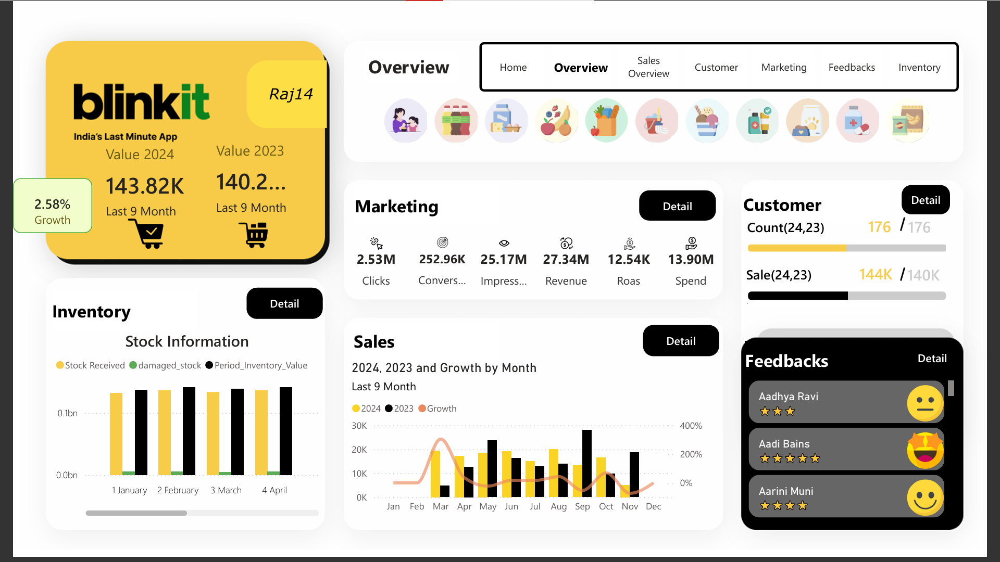
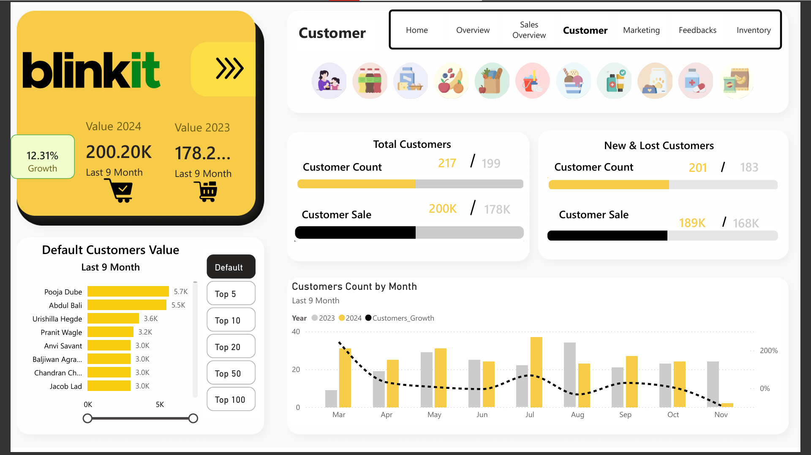
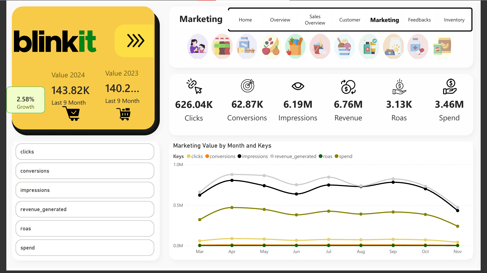
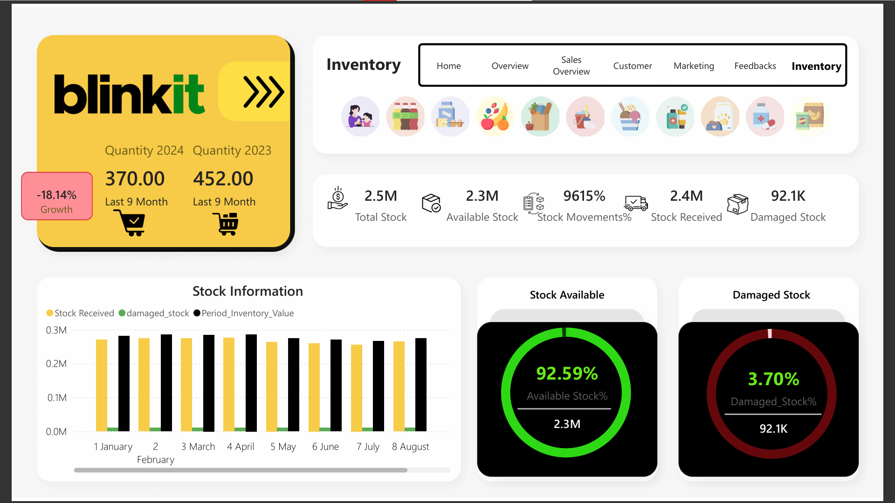
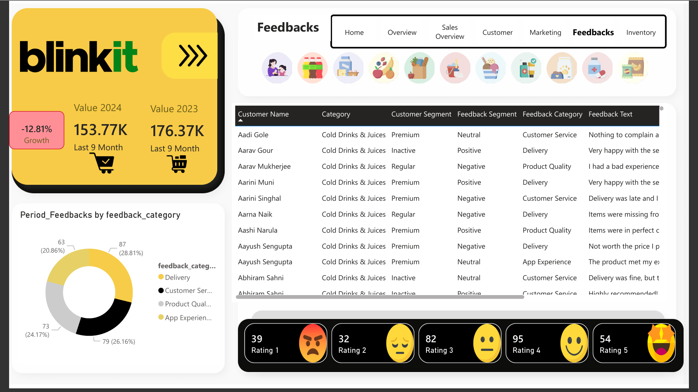
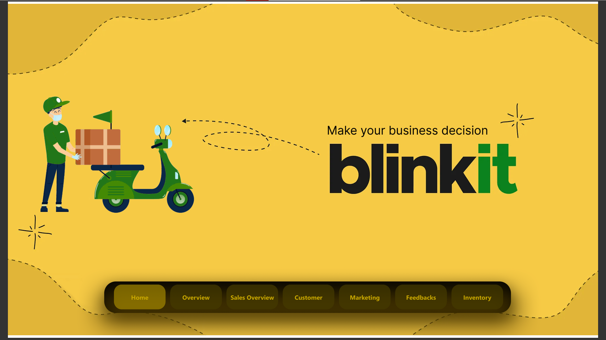

# 🛒 Blinkit Power BI Dashboard: Quick-Commerce Insights

A dynamic and interactive Power BI dashboard designed to uncover deep insights into Blinkit's operational performance — from delivery trends and inventory to customer behavior, marketing ROI, and sales intelligence. Built using real-world simulation data and SQL, this project empowers business teams to make faster, smarter decisions.

---

## 📌 Purpose

The Blinkit Power BI Dashboard is a multi-page, visually rich analytics solution that consolidates key metrics like deliveries, customer satisfaction, inventory flow, and campaign effectiveness. It’s designed to help stakeholders optimize operations and boost customer experience in the competitive quick-commerce space.

---

## 🧰 Tech Stack

The dashboard was built using the following tools and technologies:

- 📊 **Power BI Desktop** – Core platform for visualization and dashboard creation  
- 📂 **Power Query** – Data ingestion, shaping, and cleaning  
- 🧠 **DAX (Data Analysis Expressions)** – Custom metrics and KPIs  
- 📝 **Data Modeling** – Relationships across orders, inventory, feedback, and more  
- 🧾 **File Format** – `.pbix` for development, `.pdf` for reporting, and `.sql` for ETL  
- 🛢 **SQL** – Data transformation and filtering at the source before loading into Power BI

---

## 🗂 Data Source

**Simulated Blinkit Operational Dataset**, modeled to reflect real-world structures:

- Orders and deliveries with timestamps and fulfillment metrics  
- Product-level inventory and restocking records  
- Customer segmentation and feedback logs  
- Marketing campaign performance data  
- Regional revenue, retention, and satisfaction indicators  

The data was modeled into multiple dimension and fact tables for cross-functional analysis and drill-down reporting in Power BI.

---

## 🛠️ SQL Contribution

SQL was used to pre-process and transform raw data before loading it into Power BI. Some example queries:

```sql
-- Calculate Monthly Sales
SELECT 
  FORMAT(order_date, 'yyyy-MM') AS Month,
  SUM(order_amount) AS Total_Sales
FROM orders
GROUP BY FORMAT(order_date, 'yyyy-MM');

-- Customer Segmentation
SELECT 
  customer_id,
  COUNT(order_id) AS total_orders,
  CASE 
    WHEN COUNT(order_id) = 1 THEN 'New'
    WHEN COUNT(order_id) BETWEEN 2 AND 4 THEN 'Regular'
    ELSE 'Premium'
  END AS customer_segment
FROM orders
GROUP BY customer_id;

-- Inventory Status
SELECT 
  category,
  SUM(quantity_available) AS Available_Stock,
  SUM(quantity_damaged) AS Damaged_Stock
FROM inventory
GROUP BY category;
```
---

## 🌟 Highlights

### 💼 Business Problem

Blinkit operates in a fast-paced, high-volume delivery environment. The lack of a unified analytics dashboard made it difficult for teams to track KPIs, react to delivery issues, monitor customer sentiment, and optimize marketing in real time.

### 🎯 Goal of the Dashboard

To develop an intuitive, scalable Power BI dashboard that:
- Centralizes data across key operational areas
- Enables dynamic filtering by region, time, and category
- Provides actionable insights to improve service quality and operational flow
- Supports both granular and high-level decision-making

---

## 🔎 Walkthrough of Key Visuals

### 🏠 1. **Overview Page**
- **📈 Deliveries Over Time (Line Chart):** Identify demand trends, seasonality, and spikes  
- **🎯 Delivery Completion Rate (Donut):** Track delivery success vs delays  
- **📍 Revenue by Region (Bar Chart):** Compare performance across cities or zones  



---

### 👥 2. **Customer Insights**
- **📊 Retention Rate (Gauge):** Track loyalty over time  
- **💎 Top Customers (Table):** Identify high-revenue customers  
- **💬 Feedback Trends (Word Cloud / Sentiment):** Understand customer satisfaction and pain points  



---

### 📣 3. **Marketing Dashboard**
- **📉 Campaign ROI (Bar/Funnel):** Understand ad spend performance  
- **📦 Acquisition by Channel (Pie):** Evaluate social, email, referral, etc.  
- **🌍 Marketing Spend by Region (Stacked Bar):** Analyze regional marketing success  



---

### 📦 4. **Inventory Page**
- **📦 Stock Levels by Category (Bar):** Avoid stockouts and overstock  
- **🔄 Inventory Turnover Ratio (KPI):** Optimize stock flow  
- **⚠️ Low Stock Alerts (Heatmap):** Proactive procurement triggers  



---

### 💰 5. **Sales Overview**
- **💸 Revenue by Product Category (Column):** Understand product mix impact  
- **📈 Monthly Sales Trends (Line):** Spot dips and peaks in demand  
- **🛒 Average Order Value (KPI):** Cross-sell and upsell analysis  


---

### 💬 6. **Customer Feedback**
- **⭐ Ratings Breakdown:** Distribution from 1-star to 5-star  
- **📋 Text Analysis:** Categorized feedback based on delivery, service, app experience  
- **🎯 Sentiment Score:** Positive vs Negative trends over time  



---

## 🚀 Business Impact & Insights

- 📦 **Delivery Optimization:** Identify bottlenecks & improve delivery completion  
- 💬 **Customer Experience:** Improve retention & satisfaction using feedback  
- 📊 **Sales Growth:** Target high-performing categories & upsell opportunities  
- 📣 **Marketing Efficiency:** Focus budget on high-ROI campaigns  
- 🧾 **Inventory Planning:** Prevent overstocking and stockouts via alerts & turnover  

---

## 🖼️ Screenshots / Demo Summary

| Section | Screenshot |
|--------|------------|
| Home |  |
| Overview |  |
| Customer |  |
| Marketing |  |
| Inventory |  |
| Sales Overview |  |
| Feedbacks |  |

---

